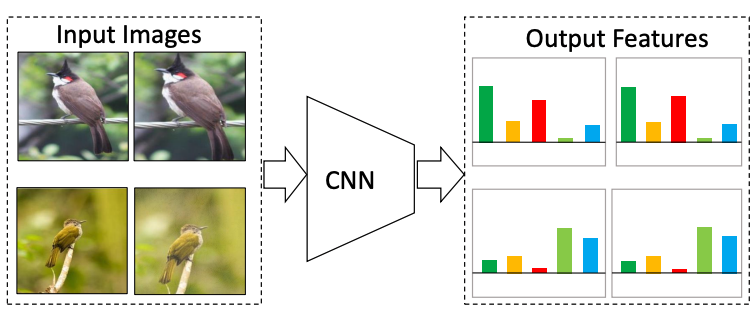
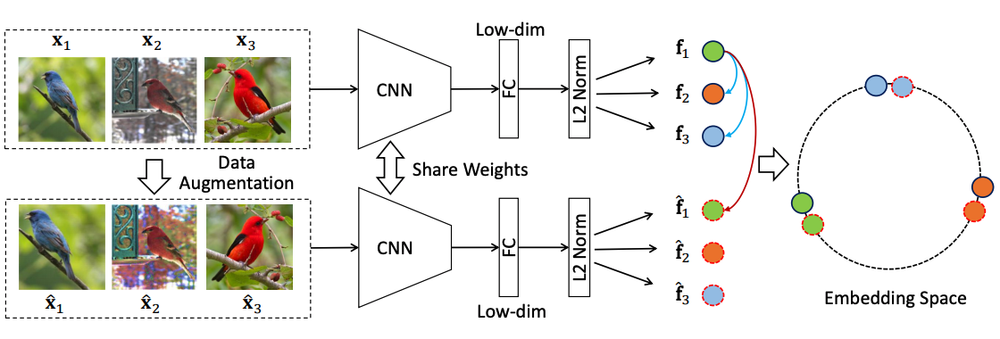
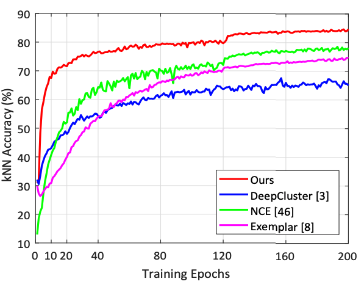

# Unsupervised_Embedding_Learning

Pytorch code for Unsupervised Embedding Learning via Invariant and Spreading Instance Feature in CVPR 2019. [(arXiv)](https://arxiv.org/abs/1904.03436).

## Highlight

The goal of this work is to learn a feature extraction DNN, such that features of the same instance under different data augmentations should be invariant, while features of different image instances should be separated.



We propose to optimize the embedding directly on the real-time instance features with softmax function.



The proposed feature achieves much faster learning speed and better accuracy.


The learned embedding performs well on both seen and unseen testing categories.

## Usage

Our code extends the pytorch implementation of NCE paper in [Github](https://github.com/zhirongw/lemniscate.pytorch). 
Please refer to the official repo for details of data preparation and hardware configurations.

- Prerequisites: Python2.7, [pytorch=0.4](http://pytorch.org), Numpy, TensorboardX, Scikit_learn

- Clone this repo: `git clone https://github.com/mangye16/Unsupervised_Embedding_Learning`

## Training on Seen Testing Categories

The training and testing set share the same categories. We use kNN classifier to evaluate the performance follow the settings in [NCE](https://arxiv.org/pdf/1805.01978.pdf) paper.

```bash
python demo_seen.py --dataset cifar --batch-t 0.1 --lr 0.03 --low-dim 128 --batch-size 128 --gpu 0,1,2,3
```

  - `--dataset`: "cifar": cifar-10 dataset, "stl": stl-10 dataset.
  
  - `--batch-t`: softmax temperature parameter (0.05-0.1).
  
  - `--lr`: learning rate (initialization: 0.03).
  
  - `--low-dim`: the feature embedding dimension (default: 128).
  
  - `--batch-size`: the training batch size (Generally, larger batch size results in better performance)
  
  - `--gpu`: gpu used for training 

## Training on Unseen Testing Categories

The training and testing set DO NOT share any common categories. We use recall at K accuracy to evaluate the performance following existing deep metric learning papers.

#### 1) Dataset Preparation

  Prepare the data. Download the datasets first. Then run codes in `./pre_process/` to download and pre-process each dataset

  You may use 
  ```bash
  python pre_process_bird.py
  ```
  Alternatively, you can use the [code](https://github.com/ColumbiaDVMM/Heated_Up_Softmax_Embedding/tree/master/dataset) to directly  download and pre-process the datasets.

  **Remember to change the dataset path to your own path.**

#### 2) Start Training

```bash
python demo_unseen.py --dataset cub200 --arch inception_v1_ml --lr 0.01 --low-dim 128 --batch-size 64 --gpu 0
```

  - `--dataset`: "cub200": CUB200-2011 dataset or, "car196": Cars196 dataset, "ebay": Stanford Online Product dataset.
  
  - `--arch`: backbone network structure (defualt: inception_v1_ml).
  
  - `--lr`: learning rate (initialization: 0.01).
  
  - `--gpu`: gpu used for training (only support single GPU training for inception_v1 backbone)
  
  
### Citation

Please kindly cite this paper in your publications if it helps your research:
```
@inproceedings{cvpr19unsupervised,
  title={Unsupervised Embedding Learning via Invariant and Spreading Instance Feature},
  author={Ye, Mang and Zhang, Xu and Yuen, Pong C. and Chang, Shih-Fu},
  booktitle={IEEE International Conference on Computer Vision and Pattern Recognition (CVPR)},
  year={2019},
}
```

Contact: mangye16@gmail.com
